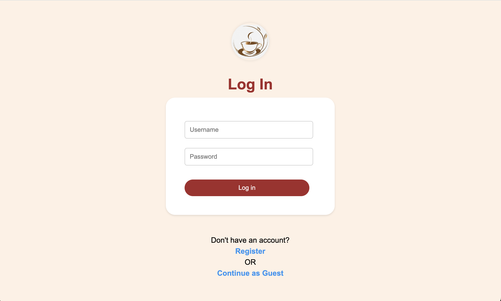

# CoffeeMaker ☕️

A full-stack Java-based web application simulating a virtual coffee shop — built to handle user roles, inventory, and recipe management with full test coverage and real-time validation. This project is designed with industry-standard practices using Spring Boot, Thymeleaf, JUnit, and a MySQL database.

---

## 🧠 Project Summary

CoffeeMaker allows customers to place coffee orders, managers to manage inventory and recipes, and staff to fulfill orders. It mimics the flow of a real-world coffee shop while demonstrating secure user role management, data persistence, and unit/integration testing.

---

## 🔧 Technologies Used

| Layer         | Tech Stack                          |
|--------------|-------------------------------------|
| Frontend     | HTML, CSS, Thymeleaf (Spring MVC)   |
| Backend      | Java, Spring Boot, Spring Security  |
| Database     | MySQL, Spring Data JPA (Hibernate)  |
| Testing      | JUnit 5, MockMVC, Mockito            |
| Build Tool   | Maven                               |

---

## 👥 User Roles

- **Customer**: Browse and place orders.
- **Staff**: View and fulfill drink orders.
- **Manager**: Manage recipes, inventory, and user accounts.

---

## ✅ Key Features

- 🧾 **Recipe and Inventory Management**
- 👤 **Role-Based Access Control (RBAC)**
- ☕ **Order Fulfillment and Workflow**
- 🔒 **Secure Authentication and Authorization**
- 🧪 **High Test Coverage with JUnit and MockMVC**
- 🧰 **RESTful API endpoints**

---

## 🚀 How to Run the Project

1. **Clone the Repository**
   ```bash
   git clone https://github.com/your-username/CoffeeMaker.git
   cd CoffeeMaker
   ```

2. **Start MySQL Server** and create the database:
   ```sql
   CREATE DATABASE coffeemaker;
   ```

3. **Run the Application**
   ```
   mvn spring-boot:run
   ```

4. **Visit in Browser**
   ```
   http://localhost:8080
   ```

---

## 🧪 Testing

All unit and integration tests are located in `src/test/java`.

- Run with:
  ```bash
  mvn test
  ```

- **Line Coverage (Goal: ≥70%)**
  
  

- **Branch Coverage (Goal: ≥50%)**
  
  

---

## 📁 Project Structure Overview

```
CoffeeMaker/
├── controllers/      # Spring MVC controllers
├── models/           # Entity classes (User, Recipe, Ingredient, etc.)
├── repositories/     # Spring Data JPA interfaces
├── services/         # Business logic layer
├── templates/        # Thymeleaf HTML pages
├── static/           # CSS and JS files
├── tests/            # JUnit 5 tests
└── application.properties
```

---

## 👀 Demo Screenshots

| Login | Inventory | Make Coffee |
|-------|-----------|-------------|
|  |  |  |

---

## ✍️ Author

**[Afnan Idries]**  
📧 ahidries@ncsu.edu
🔗 [LinkedIn](https://linkedin.com/in/afnanidries) | [GitHub](https://github.com/afnanidries/Projects)

---

## 📌 Notes

- Developed as part of a course project at NC State.
- Built with test-driven development and security best practices in mind.

---

## 📄 License

MIT License
